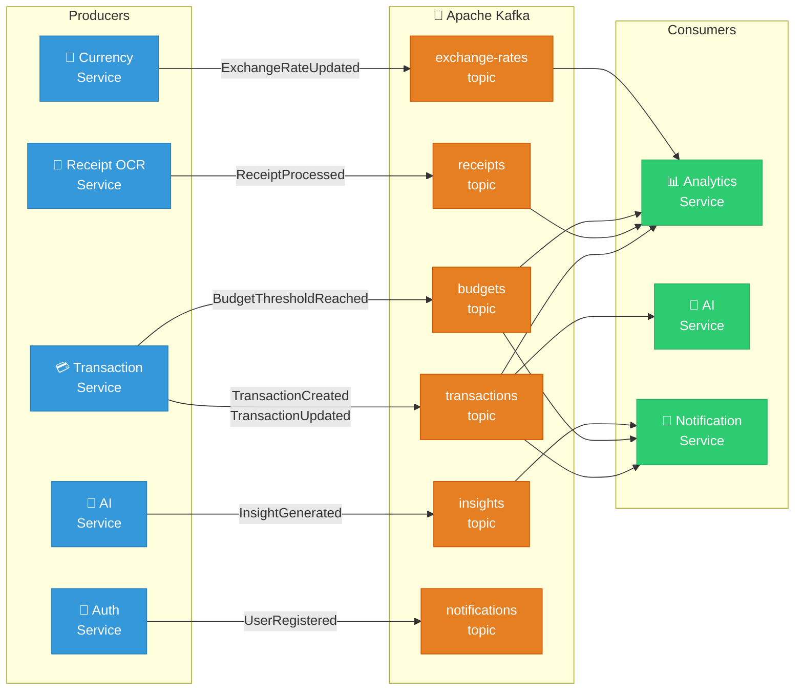

# FinTrack AI — System Architecture

## Full System Architecture

```mermaid
graph TB
    subgraph CLIENT["📱 Mobile App (React Native 0.74)"]
        direction TB
        RN["React Native + TypeScript"]
        RTK["Redux Toolkit + RTK Query"]
        NAV["React Navigation\n(Stack + Bottom Tabs)"]
        OFFLINE["Offline Queue\n(MMKV Storage)"]
        SCREENS["Screens:\n• Login\n• Dashboard\n• Transactions\n• Analytics\n• Profile"]
        RN --> RTK
        RN --> NAV
        RN --> OFFLINE
        NAV --> SCREENS
    end

    subgraph GW["🔀 API Gateway :3000"]
        PROXY["Proxy Service\nRoute Dispatcher"]
        RATE["Rate Limiter\n100 req/min"]
        HEALTH["Health Check\n/api/v1/health"]
        PROXY --- RATE
        PROXY --- HEALTH
    end

    subgraph SERVICES["🧩 Backend Microservices (NestJS + Fastify)"]
        direction TB
        subgraph AUTH["🔐 Auth Service :3001"]
            AUTH_F["• JWT Access (15min)\n• Refresh Token Rotation (7d)\n• Bcrypt Hashing\n• OAuth2 Ready\n• MFA Support"]
        end
        subgraph USER["👤 User Service :3002"]
            USER_F["• Profile CRUD\n• Preferences\n• Locale/Timezone\n• Default Currency"]
        end
        subgraph TXN["💳 Transaction Service :3003"]
            TXN_F["• Income/Expense CRUD\n• Budget Management\n• Merchant Tagging\n• Pagination"]
        end
        subgraph ANALYTICS["📊 Analytics Service :3004"]
            ANALYTICS_F["• Spend Aggregation\n• Trend Detection\n• Anomaly Detection\n• Daily/Weekly/Monthly"]
        end
        subgraph AI["🤖 AI Service :3005"]
            AI_F["• Merchant Categorization\n• Confidence Scoring\n• Overspend Alerts\n• Saving Opportunities\n• Forecasts"]
        end
        subgraph NOTIF["🔔 Notification Service :3006"]
            NOTIF_F["• Multi-Channel\n  (Push/Email/SMS/In-App)\n• Queue + Retry\n• Preference-Aware"]
        end
        subgraph OCR["📸 Receipt OCR :3007"]
            OCR_F["• Image Upload\n• AWS Textract OCR\n• Line-Item Parsing\n• Merchant Normalization"]
        end
        subgraph CURRENCY["💱 Currency Service :3008"]
            CURRENCY_F["• FX Rate Fetch\n• Multi-Level Cache\n• Pair Conversion\n• Auto-Refresh"]
        end
        subgraph BANK["🏦 Bank Integration :3009"]
            BANK_F["• Open Banking (Planned)\n• Account Sync\n• Webhook Ingest\n• Deduplication"]
        end
    end

    subgraph INFRA["🗄️ Infrastructure Layer"]
        direction LR
        PG["🐘 PostgreSQL 16\n:5432\n─────────────\n• fintrack_auth\n• fintrack_users\n• fintrack_transactions\n• fintrack_analytics\n• fintrack_currency\n• fintrack_notifications"]
        MONGO["🍃 MongoDB 7\n:27017\n─────────────\n• fintrack_receipts"]
        REDIS["⚡ Redis 7\n:6379\n─────────────\n• Session Cache\n• Rate Limiting\n• FX Rate Cache\n• Token Blacklist"]
        KAFKA["📨 Kafka 7.6\n:9092\n─────────────\nTopics:\n• transactions\n• receipts\n• budgets\n• insights\n• exchange-rates\n• notifications"]
        ZK["🔧 Zookeeper\n:2181"]
        ES["🔍 Elasticsearch 8.13\n:9200\n─────────────\n• spend_analytics index"]
    end

    subgraph CLOUD["☁️ AWS Cloud (Terraform)"]
        direction LR
        VPC["VPC 10.0.0.0/16"]
        EKS["EKS Cluster v1.29\nNode: t3.medium\n2-10 nodes"]
        RDS["RDS PostgreSQL\ndb.t3.medium\nMulti-AZ (prod)"]
        S3["S3 Bucket\nReceipt Images\nKMS Encrypted"]
        EC["ElastiCache Redis\ncache.t3.micro"]
    end

    subgraph OBSERVE["🔭 Observability"]
        OTEL["OpenTelemetry\nOTLP Exporter"]
        PROM["Prometheus\nMetrics"]
        ELK["ELK Stack\nLogs"]
        GRAFANA["Grafana\nDashboards"]
        OTEL --> PROM
        OTEL --> ELK
        PROM --> GRAFANA
    end

    %% Client to Gateway
    CLIENT -->|"HTTPS REST\nBearer JWT"| GW

    %% Gateway to Services
    GW -->|"/auth"| AUTH
    GW -->|"/users"| USER
    GW -->|"/transactions"| TXN
    GW -->|"/analytics"| ANALYTICS
    GW -->|"/insights"| AI
    GW -->|"/notifications"| NOTIF
    GW -->|"/receipts"| OCR
    GW -->|"/currency"| CURRENCY
    GW -->|"/bank"| BANK

    %% Service to DB connections
    AUTH --> PG
    AUTH --> REDIS
    USER --> PG
    TXN --> PG
    ANALYTICS --> PG
    ANALYTICS --> ES
    NOTIF --> PG
    CURRENCY --> PG
    CURRENCY --> REDIS
    AI --> REDIS
    OCR --> MONGO
    OCR --> S3

    %% Kafka connections
    AUTH -.->|"emit"| KAFKA
    TXN -.->|"TransactionCreated"| KAFKA
    OCR -.->|"ReceiptProcessed"| KAFKA
    CURRENCY -.->|"ExchangeRateUpdated"| KAFKA
    AI -.->|"InsightGenerated"| KAFKA
    KAFKA -.->|"consume"| ANALYTICS
    KAFKA -.->|"consume"| AI
    KAFKA -.->|"consume"| NOTIF
    ZK --- KAFKA

    %% Observability
    SERVICES -.-> OTEL

    classDef client fill:#4A90D9,stroke:#2C5F8A,color:#fff
    classDef gateway fill:#F5A623,stroke:#D4881A,color:#fff
    classDef service fill:#7ED321,stroke:#5A9A18,color:#fff
    classDef infra fill:#9B59B6,stroke:#7D3C98,color:#fff
    classDef cloud fill:#E74C3C,stroke:#C0392B,color:#fff
    classDef observe fill:#1ABC9C,stroke:#16A085,color:#fff

    class CLIENT client
    class GW gateway
    class AUTH,USER,TXN,ANALYTICS,AI,NOTIF,OCR,CURRENCY,BANK service
    class PG,MONGO,REDIS,KAFKA,ZK,ES infra
    class VPC,EKS,RDS,S3,EC cloud
    class OTEL,PROM,ELK,GRAFANA observe
```



---

## Kafka Event Flow



---

## Service Details

### API Routes (Gateway → Microservices)

| Route                   | Service                   | Port | Database                  |
| ----------------------- | ------------------------- | ---- | ------------------------- |
| `/api/v1/auth`          | Auth Service              | 3001 | PostgreSQL, Redis         |
| `/api/v1/users`         | User Service              | 3002 | PostgreSQL                |
| `/api/v1/transactions`  | Transaction Service       | 3003 | PostgreSQL                |
| `/api/v1/analytics`     | Analytics Service         | 3004 | PostgreSQL, Elasticsearch |
| `/api/v1/insights`      | AI Recommendation Service | 3005 | Redis                     |
| `/api/v1/notifications` | Notification Service      | 3006 | PostgreSQL                |
| `/api/v1/receipts`      | Receipt OCR Service       | 3007 | MongoDB, S3               |
| `/api/v1/currency`      | Currency Service          | 3008 | PostgreSQL, Redis         |
| `/api/v1/bank`          | Bank Integration Service  | 3009 | _(planned)_               |

### Infrastructure Services (Docker Compose)

| Service       | Image                | Port  | Purpose                        |
| ------------- | -------------------- | ----- | ------------------------------ |
| PostgreSQL    | postgres:16-alpine   | 5432  | Primary relational DB          |
| MongoDB       | mongo:7              | 27017 | Document store (receipts)      |
| Redis         | redis:7-alpine       | 6379  | Cache, rate-limiting, sessions |
| Kafka         | cp-kafka:7.6.0       | 9092  | Event streaming                |
| Zookeeper     | cp-zookeeper:7.6.0   | 2181  | Kafka coordination             |
| Elasticsearch | elasticsearch:8.13.0 | 9200  | Analytics indexing             |

### Technology Stack

| Layer         | Technology                                  |
| ------------- | ------------------------------------------- |
| Frontend      | React Native 0.74, Redux Toolkit, RTK Query |
| Backend       | NestJS 10.3 + Fastify                       |
| Language      | TypeScript 5.4                              |
| Databases     | PostgreSQL 16, MongoDB 7                    |
| Cache         | Redis 7                                     |
| Messaging     | Apache Kafka (Confluent 7.6)                |
| Search        | Elasticsearch 8.13                          |
| Cloud         | AWS (EKS, RDS, S3, ElastiCache)             |
| IaC           | Terraform 1.7+                              |
| Orchestration | Kubernetes (EKS v1.29)                      |
| Observability | OpenTelemetry, Prometheus, Grafana, ELK     |
| CI/CD         | GitHub Actions                              |

### Mobile App Navigation

```
AppNavigator
├── Authenticated → MainTabs (Bottom Tabs)
│   ├── Dashboard    — Quick stats, recent activity
│   ├── Transactions — CRUD, filtering, search
│   ├── Analytics    — Charts, spend breakdowns
│   └── Profile      — Settings, preferences
└── Unauthenticated → Auth Stack
    └── LoginScreen  — Register / Login
```

### Security

- **Authentication:** JWT (15min access + 7-day refresh rotation)
- **Password Storage:** bcrypt (12 salt rounds)
- **Authorization:** Role-based guards (RBAC)
- **Rate Limiting:** 100 requests/min per client
- **Encryption:** KMS for S3, TLS in transit
- **Token Blacklist:** Redis-backed
- **Mobile Storage:** react-native-encrypted-storage
